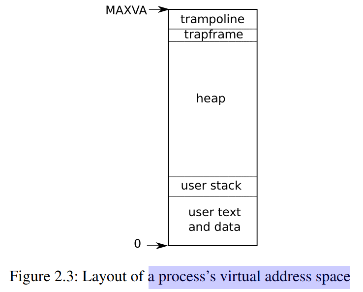
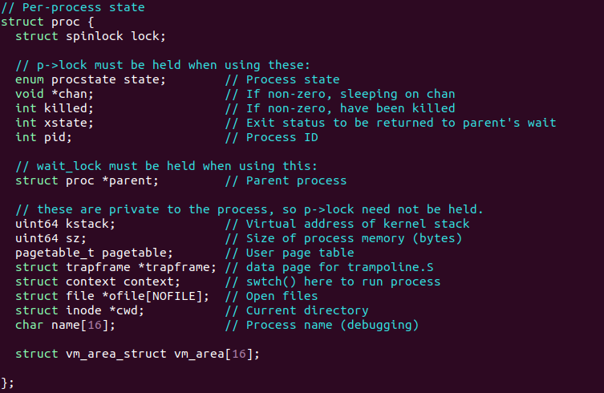
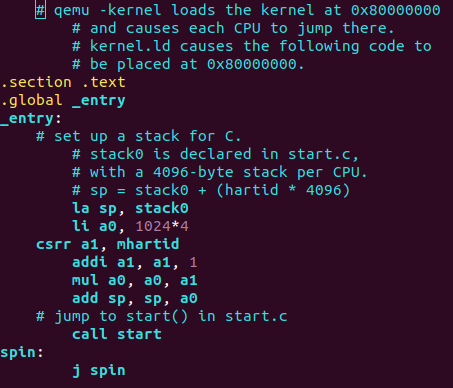
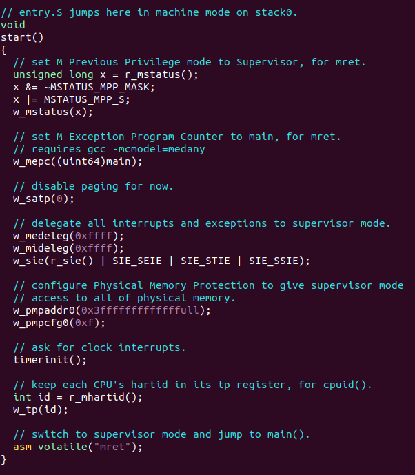
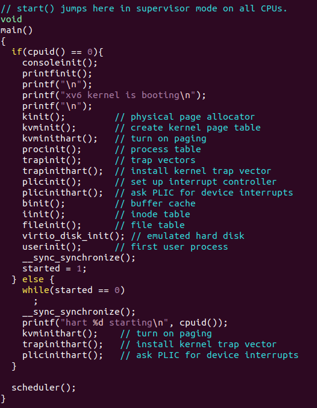
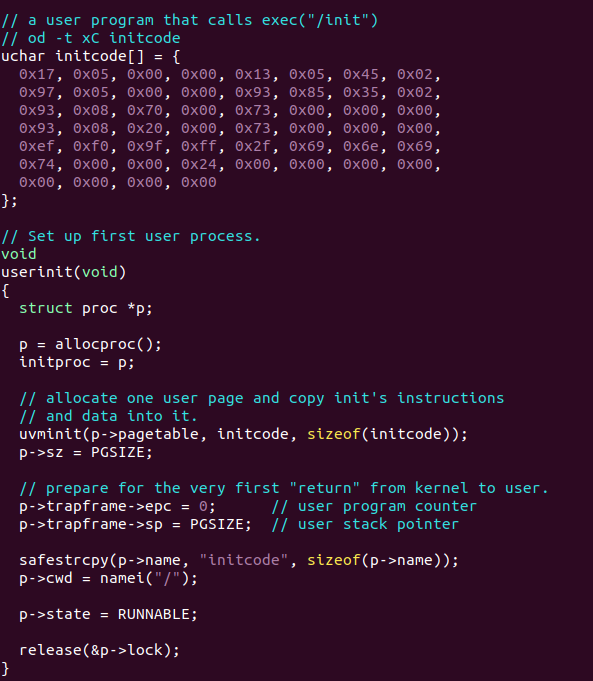
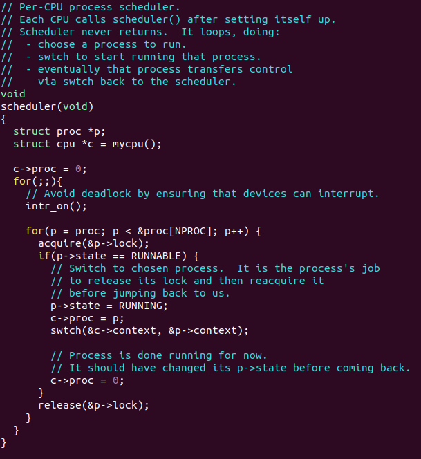
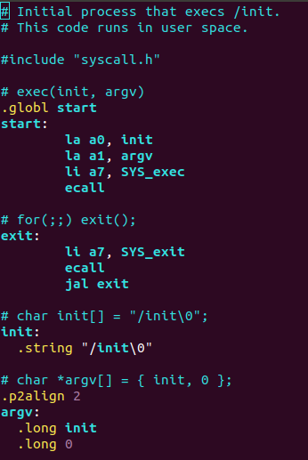
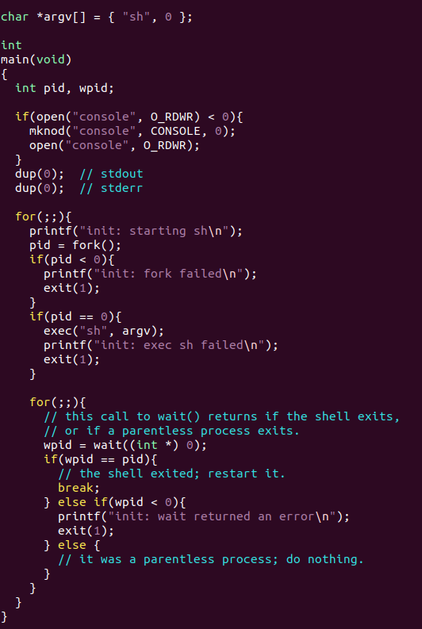

操作系统需要具有三个特性：**multiplexing**、**isolation**、**interaction**

# 2.2 User mode, supervisor mode, and system calls

CPU为**隔离性**提供了硬件支持，以RISC-V为例，CPU可以在machine mode，supervisor mode和user mode执行。
machine mode权限最高，通常用来配置计算机，CPU最开始的执行权限就是machine mode。supervisor mode可以执行
特权指令，如打开/关闭中断, 读/写存储页表地址的寄存器等。

运行在user mode的应用被称为运行在用户空间，运行在supervisor mode的应用被称为内核。
如果应用从切换到supervisor mode，RISC-V提供了ecall指令，sret返回用户空间。

# 2.3 Kernel organization

monolithic kernel ： 整个操作系统都在supervisor mode
    优点：简化OS设计者的负担，不用考虑操作系统那部分应该放在内核中
    缺点：在内核的错误会导致内核无法运行

microkernel ： 减少运行在supervisor mode的操作系统的代码
    优点：代码量更小，内核依赖性更高
    缺点：通信效率较低

# 2.4 xv6的结构

# 2.5 进程概览

  xv6的每个进程拥有一个页表，这使得每个进程都有自己的进程空间，如上图所示。xv6通过trampoline和trapframe来保存和恢复用进程的状态，从而进入和或退出内核。

  进程的状态（本地变量、函数返回地址）存储在进程的栈中。每个进程有两个栈，用户栈和内核栈。当进程在用户空间执行，只有用户栈被用到，内核栈为空。当进程在内核空间执行，只有内核栈被用到，但用户栈保存被保存数据。

# 2.6 xv6的启动，第一个进程和系统调用

当电脑开机时，它先初始化自身，然后执行存储在RAM的boot loader。boot loader加载xv6的内核到内存中，然后CPU在machine mode从_entry(kernel/entry.S:7)开始执行xv6。_entry初始化栈空间，然后调用start(kernel.start.c:11)

mret：从machine mode返回到mstatus记录的上一个mode(supervisor/user)

设置machine Previous mode和mepc等配置，调用mret跳到supervisor的main(kernel/main.c:11)函数中

userinit(kernel/proc.c)初始化第一个用户进程，然后main中的scheduler切换到initcode.S(user/initcode.S)中

initcode.S传递参数a0 /init和系统调用号SYS_exec，然后执行第一个用户进程init(user/init.c)

init进程使用fork出一个子进程用来执行sh，父进程使用wait等待子进程退出，如果子进程退出，父进程重新fork子进程执行shell，让shell不断运行。
# 附录
subvert 颠覆
tailor 裁缝 tailored 量身定做的