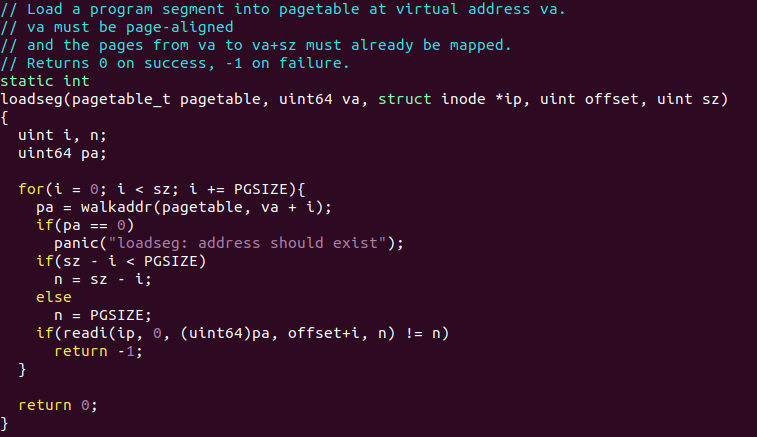

# 3.1 页表


PTE_v : PTE是否存在

PTE_R/PTE_W

PTE_U ：如果没有设置该位，该PTE只能在supervisor mode使用

每个CPU都有satp寄存器，用来存储根页表的物理地址。

# 3.2 内核地址空间


在xv6中，每个进程拥有自己的页表，内核也拥有自己的页表用来描述内核地址空间。

# 3.3 创建地址空间


main函数调用kvminit创建内核页表


kvminit调用kvmmake传建内核页表


kvmmake使用kalloc分配一个物理页给内核页表，然后调用kvmmap给页表增加映射


kvmmap调用mappages


mappages调用walk找到对应虚拟地址的pte的地址，然后修改pte里面的内容


当main中使用kvminit创建内核页表后，使用kvminithart将内核页表写入satp寄存器，然后使用sfence.vma刷新当前CPU的TLB


# 3.5 物理内存分配


物理内存结构

main调用kinit初始化物理内存空闲链表


kinit调用freearange，从内核的结束到PHYSTOP，通过kfree将每一页空闲内存加到空闲链表中


因为PTE对应地址时4096或4096的倍数，所以freearange使用PGROUNDUP来确保对齐


# 3.6 进程地址空间


每一个进程有自己的页表。正如上图所示，进程的用户内存从0开始，最大可以为MAXVA。

由图可知，stack的大小为一个页，并且刚开始的内容由exec所创建。在栈顶，字符串包括一些命令行参数，还有一些指向他们的数组。

在下面是main函数的参数。栈的下面是一个保护页，PTE_U没有被设置，用以保护栈溢出。

# 3.7 sbrk

sbrk是进程用来扩大或缩小内存的系统调用。


sbrk调用growproc来增加或缩小内存，返回变化前的进程大小


如果n为正数，调用uvmalloc增加内存，反着用uvmdealloc缩小内存


uvmalloc调用mappages给进程页表增加映射


uvmdealloc调用uvmunmap减少映射


uvmunmap使用walk找到pte，将pte所指向的物理地址释放，并将pte的内容改为0


# 3.8 exec

exec是用来创建用户部分的地址空间

```
int
exec(char *path, char **argv)
{
  char *s, *last;
  int i, off;
  uint64 argc, sz = 0, sp, ustack[MAXARG], stackbase;
  struct elfhdr elf;
  struct inode *ip;
  struct proghdr ph;
  pagetable_t pagetable = 0, oldpagetable;
  struct proc *p = myproc();

  begin_op();

  if((ip = namei(path)) == 0){
    end_op();
    return -1;
  }
  ilock(ip);

  // Check ELF header
  if(readi(ip, 0, (uint64)&elf, 0, sizeof(elf)) != sizeof(elf))
    goto bad;
  if(elf.magic != ELF_MAGIC)
    goto bad;

  if((pagetable = proc_pagetable(p)) == 0)
    goto bad;

  // Load program into memory.
  // program section headers
  // Each proghdr describes a section of the application that must be loaded into memor
  for(i=0, off=elf.phoff; i<elf.phnum; i++, off+=sizeof(ph)){
    if(readi(ip, 0, (uint64)&ph, off, sizeof(ph)) != sizeof(ph))
      goto bad;
    if(ph.type != ELF_PROG_LOAD)
      continue;
    if(ph.memsz < ph.filesz)
      goto bad;
    if(ph.vaddr + ph.memsz < ph.vaddr)
      goto bad;
    uint64 sz1;
    // allocates memory for each ELF segment with uvmalloc
    if((sz1 = uvmalloc(pagetable, sz, ph.vaddr + ph.memsz)) == 0)
      goto bad;
    sz = sz1;
    if((ph.vaddr % PGSIZE) != 0)
      goto bad;
    //  loads each segment into memory with loadseg
    if(loadseg(pagetable, ph.vaddr, ip, ph.off, ph.filesz) < 0)
      goto bad;
  }
  iunlockput(ip);
  end_op();
  ip = 0;

  p = myproc();
  uint64 oldsz = p->sz;

  // Allocate two pages at the next page boundary.
  // Use the second as the user stack.
  sz = PGROUNDUP(sz);
  uint64 sz1;
  if((sz1 = uvmalloc(pagetable, sz, sz + 2*PGSIZE)) == 0)
    goto bad;
  sz = sz1;
  uvmclear(pagetable, sz-2*PGSIZE);
  sp = sz;
  stackbase = sp - PGSIZE;

  // Push argument strings, prepare rest of stack in ustack.
  for(argc = 0; argv[argc]; argc++) {
    if(argc >= MAXARG)
      goto bad;
    sp -= strlen(argv[argc]) + 1;
    sp -= sp % 16; // riscv sp must be 16-byte aligned
    if(sp < stackbase)
      goto bad;
    if(copyout(pagetable, sp, argv[argc], strlen(argv[argc]) + 1) < 0)
      goto bad;
    ustack[argc] = sp;
  }
  ustack[argc] = 0;

  // push the array of argv[] pointers.
  sp -= (argc+1) * sizeof(uint64);
  sp -= sp % 16;
  if(sp < stackbase)
    goto bad;
  if(copyout(pagetable, sp, (char *)ustack, (argc+1)*sizeof(uint64)) < 0)
    goto bad;

  // arguments to user main(argc, argv)
  // argc is returned via the system call return
  // value, which goes in a0.
  p->trapframe->a1 = sp;

  // Save program name for debugging.
  for(last=s=path; *s; s++)
    if(*s == '/')
      last = s+1;
  safestrcpy(p->name, last, sizeof(p->name));

  // Commit to the user image.
  oldpagetable = p->pagetable;
  p->pagetable = pagetable;
  p->sz = sz;
  p->trapframe->epc = elf.entry;  // initial program counter = main
  p->trapframe->sp = sp; // initial stack pointer
  proc_freepagetable(oldpagetable, oldsz);

  return argc; // this ends up in a0, the first argument to main(argc, argv)

 bad:
  if(pagetable)
    proc_freepagetable(pagetable, sz);
  if(ip){
    iunlockput(ip);
    end_op();
  }
  return -1;
}


```
exec使用namei打开path的二进制，然后读二进制的ELF头。ELF二进制包括一个ELF头(struct elfhdr)，然后是一系列的程序节头(program section header， struct proghdr)。每一个proghdr描述了要加载进内存的应用的一部分。xv6只有一个proghrd。

ELF二进制由4字节的魔数开始。如果ELF头部由正确的魔数，exec会假设二进制是正确的。

exec首先用proc_pagetable分配一个新的页表，然后给ELF段分配内存，并将每一段用loadseg加载到内存中



loadseg使用walkaddr找到对应虚拟地址的物理地址，由于内核是恒等映射，所以通过readi直接从物理地址读取文件