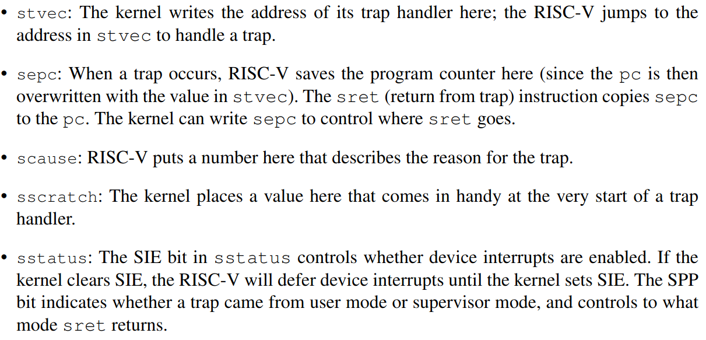

Traps分为三种，第一种是系统调用，用户程序执行ecall指令来要求内核做一些事，第二种是异常(exception)，在用户空间或内核空间的指令做了一些非法的操作，如除以0，使用了无效的虚拟地址等，第三种是中断(interrupt)。

xv6对于trap的处理有4个阶段，RISC-V CPU的硬件操作、进入内核前的一些汇编指令、决定怎么处理trap的C函数、系统调用或设备驱动的例程。

内核处理trap有一个统一的入口。然后分为三种情况处理，traps from user space, traps
from kernel space, and timer interrupts。处理trap的代码叫做handler，第一个handler通常是用汇编写的，被称为vector。

# 4.1 RISC-V trap machinery



以上的寄存器主要用于supervisor mode处理trap用的，并且他们不能在user mode被读/写。每个CPU都有这么一套寄存器。

trap发生时，riscv硬件的处理流程
```
1. If the trap is a device interrupt, and the sstatus SIE bit is clear, don’t do any of the
following. 如果已经关中断，什么都不做
2. Disable interrupts by clearing the SIE bit in sstatus. 关中断
3. Copy the pc to sepc. 保存断点
4. Save the current mode (user or supervisor) in the SPP bit in sstatus. 保存当前mode到sstatus的SPP位
5. Set scause to reflect the trap’s cause. 设置scause
6. Set the mode to supervisor. 设置当前模式为supervisor
7. Copy stvec to the pc. 跳到trap处理的地方
8. Start executing at the new pc  中断事件处理
```
注意到CPU没有自动切换内核页表，没有切换内核栈，除了pc以外没有保存任何寄存器，所以内核软件应该做这些任务。

# 4.2 Traps from user space

从用户空间来的trap流程 : 
  跳入 : uservec (kernel/trampoline.S:16) --> usertrap (kernel/trap.c:37)
  返回 : usertrapret (kernel/trap.c:90)  --> userret (kernel/trampoline.S:88)

uservec ： 保存32个寄存器的值到内存中，然后跳到usertrap()
usertrap ： 处理来自用户空间的中断、异常或系统调用


对于每个进程的页表，都有一个trampoline页映射。 trampoline页包含**uservec**，也就是xv6处理trap的代码指向的地方(stvec)。因为用户页表的trampoline映射有PTE_U标志，所以trap可以在supervisor-mode开始执行，然后trap handler可以在切换内核也表后继续执行。因为内核页表页也有trampoline的映射。

```
.globl trampoline
trampoline:
.align 4
.globl uservec
uservec:
    #
        # trap.c sets stvec to point here, so
        # traps from user space start here,
        # in supervisor mode, but with a
        # user page table.
        #
        # sscratch points to where the process's p->trapframe is
        # mapped into user space, at TRAPFRAME.
        #

    # swap a0 and sscratch
        # so that a0 is TRAPFRAME
        csrrw a0, sscratch, a0

        # save the user registers in TRAPFRAME
        sd ra, 40(a0)
        sd sp, 48(a0)
        sd gp, 56(a0)
        sd tp, 64(a0)
        sd t0, 72(a0)
        sd t1, 80(a0)
        sd t2, 88(a0)
        sd s0, 96(a0)
        sd s1, 104(a0)
        sd a1, 120(a0)
        sd a2, 128(a0)
        sd a3, 136(a0)
        sd a4, 144(a0)
        sd a5, 152(a0)
        sd a6, 160(a0)
        sd a7, 168(a0)
        sd s2, 176(a0)
        sd s3, 184(a0)
        sd s4, 192(a0)
        sd s5, 200(a0)
        sd s6, 208(a0)
        sd s7, 216(a0)
        sd s8, 224(a0)

    # save the user a0 in p->trapframe->a0
        csrr t0, sscratch
        sd t0, 112(a0)

        # restore kernel stack pointer from p->trapframe->kernel_sp
        ld sp, 8(a0)

        # make tp hold the current hartid, from p->trapframe->kernel_hartid
        ld tp, 32(a0)

        # load the address of usertrap(), p->trapframe->kernel_trap
        ld t0, 16(a0)

        # restore kernel page table from p->trapframe->kernel_satp
        ld t1, 0(a0)
        csrw satp, t1
        sfence.vma zero, zero

        # a0 is no longer valid, since the kernel page
        # table does not specially map p->tf.

        # jump to usertrap(), which does not return
        jr t0

```


在进入用户空间之前，内核会设置sccratch的值为每个进程trapframe的地址(即存储32个寄存器在内存的地址)。
因为我们需要记录寄存器保存在内存的地址，但32个寄存器又已经用完了，所以通过```csrrw a0, sscratch, a0```，我们交换a0和sscratch的值，使得a0的值就是32个寄存器保存在内存的地址。

Thus after swapping a0 and sscratch, a0 holds a pointer to the current process’s trapframe.
uservec now saves all user registers there, including the user’s a0, read from sscratch.

The trapframe contains the address of the current process’s kernel stack, the current CPU’s
hartid, the address of the usertrap function, and the address of the kernel page table. uservec
retrieves these values, switches satp to the kernel page table, and calls usertrap.


```
// handle an interrupt, exception, or system call from user space.
// called from trampoline.S
//
void
usertrap(void)
{
  int which_dev = 0;

  if((r_sstatus() & SSTATUS_SPP) != 0)
    panic("usertrap: not from user mode");

  // send interrupts and exceptions to kerneltrap(),
  // since we're now in the kernel.
  w_stvec((uint64)kernelvec);

  struct proc *p = myproc();

  // save user program counter.
  // r_sepc里面的值是用户进程的pc，我们要把它保存起来
  // 因为在内核中也可能有中断，如果我们不保存，用户的pc会被改变
  // usertrap might call yield to switch to another process’s kernel thread
  // usertrap可能会调用yield来切换内核进程，并有可能返回到用户空间，这会改变sepc
  p->trapframe->epc = r_sepc();

  if(r_scause() == 8){
    // system call

    if(p->killed)
      exit(-1);

    // sepc points to the ecall instruction,
    // but we want to return to the next instruction.
    p->trapframe->epc += 4;

    // an interrupt will change sstatus &c registers,
    // so don't enable until done with those registers.
    intr_on(); // 开中断，因为关于寄存器的状态已经解决了

    syscall();
  } else if((which_dev = devintr()) != 0){
    // ok
  } else {
    printf("usertrap(): unexpected scause %p pid=%d\n", r_scause(), p->pid);
    printf("            sepc=%p stval=%p\n", r_sepc(), r_stval());
    p->killed = 1;
  }

  if(p->killed)
    exit(-1);

  // give up the CPU if this is a timer interrupt.
  if(which_dev == 2)
    yield();

  usertrapret();
}

```
Job : determine the cause of the trap, process it, and return

1. It first changes stvec so that a trap while in the kernel will be handled by kernelvec
rather than uservec.

2. It saves the sepc register (the saved user program counter), because
usertrap might call yield to switch to another process’s kernel thread, and that process might
return to user space, in the process of which it will modify sepc.


```
// return to user space
//
void
usertrapret(void)
{
  struct proc *p = myproc();

  // we're about to switch the destination of traps from
  // kerneltrap() to usertrap(), so turn off interrupts until
  // we're back in user space, where usertrap() is correct.
  intr_off();

  // send syscalls, interrupts, and exceptions to trampoline.S
  w_stvec(TRAMPOLINE + (uservec - trampoline));

  // set up trapframe values that uservec will need when
  // the process next re-enters the kernel.
  p->trapframe->kernel_satp = r_satp();         // kernel page table
  p->trapframe->kernel_sp = p->kstack + PGSIZE; // process's kernel stack
  p->trapframe->kernel_trap = (uint64)usertrap;
  p->trapframe->kernel_hartid = r_tp();         // hartid for cpuid()

  // set up the registers that trampoline.S's sret will use
  // to get to user space.

  // set S Previous Privilege mode to User.
  unsigned long x = r_sstatus();
  x &= ~SSTATUS_SPP; // clear SPP to 0 for user mode
  x |= SSTATUS_SPIE; // enable interrupts in user mode
  w_sstatus(x);

  // set S Exception Program Counter to the saved user pc.
  // 之前已经将用户进程的PC保存到p->trapframe->epc中，现在将它写到sepc
  // 当sret是，sepc会写到pc
  w_sepc(p->trapframe->epc);

  // tell trampoline.S the user page table to switch to.
  uint64 satp = MAKE_SATP(p->pagetable);

  // jump to trampoline.S at the top of memory, which 
  // switches to the user page table, restores user registers,
  // and switches to user mode with sret.
  uint64 fn = TRAMPOLINE + (userret - trampoline);
  ((void (*)(uint64,uint64))fn)(TRAPFRAME, satp);
}

```


```
// return to user space
//
void
usertrapret(void)
{
  struct proc *p = myproc();

  // we're about to switch the destination of traps from
  // kerneltrap() to usertrap(), so turn off interrupts until
  // we're back in user space, where usertrap() is correct.
  intr_off();

  // send syscalls, interrupts, and exceptions to trampoline.S
  w_stvec(TRAMPOLINE + (uservec - trampoline));

  // set up trapframe values that uservec will need when
  // the process next re-enters the kernel.
  p->trapframe->kernel_satp = r_satp();         // kernel page table
  p->trapframe->kernel_sp = p->kstack + PGSIZE; // process's kernel stack
  p->trapframe->kernel_trap = (uint64)usertrap;
  p->trapframe->kernel_hartid = r_tp();         // hartid for cpuid()

  // set up the registers that trampoline.S's sret will use
  // to get to user space.

  // set S Previous Privilege mode to User.
  unsigned long x = r_sstatus();
  x &= ~SSTATUS_SPP; // clear SPP to 0 for user mode
  x |= SSTATUS_SPIE; // enable interrupts in user mode
  w_sstatus(x);

  // set S Exception Program Counter to the saved user pc.
  w_sepc(p->trapframe->epc);

  // tell trampoline.S the user page table to switch to.
  uint64 satp = MAKE_SATP(p->pagetable);

  // jump to trampoline.S at the top of memory, which 
  // switches to the user page table, restores user registers,
  // and switches to user mode with sret.
  uint64 fn = TRAMPOLINE + (userret - trampoline);
  ((void (*)(uint64,uint64))fn)(TRAPFRAME, satp);
}

```

usertrapret’s call to userret passes TRAPFRAME in a0 and a pointer to the process’s user page table in a1

```
.globl userret
userret:
        # userret(TRAPFRAME, pagetable)
        # switch from kernel to user.
        # usertrapret() calls here.
        # a0: TRAPFRAME, in user page table.
        # a1: user page table, for satp.

        # switch to the user page table.
        csrw satp, a1
        sfence.vma zero, zero

        # put the saved user a0 in sscratch, so we
        # can swap it with our a0 (TRAPFRAME) in the last step.
        ld t0, 112(a0)
        csrw sscratch, t0

        # restore all but a0 from TRAPFRAME
        ld ra, 40(a0)
        ld sp, 48(a0)
        ld gp, 56(a0)
        ld tp, 64(a0)
        ld t0, 72(a0)
        ld t1, 80(a0)
        ld t2, 88(a0)
        ld s0, 96(a0)
        ld s1, 104(a0)
        ld a1, 120(a0)
        ld a2, 128(a0)
        ld a3, 136(a0)
        ld a4, 144(a0)
        ld a5, 152(a0)
        ld a6, 160(a0)
        ld a7, 168(a0)
        ld s2, 176(a0)
        ld s3, 184(a0)
        ld s4, 192(a0)
        ld s5, 200(a0)
        ld s6, 208(a0)
        ld s7, 216(a0)
        ld s8, 224(a0)
        ld s9, 232(a0)
        ld s10, 240(a0)
        ld s11, 248(a0)
        ld t3, 256(a0)
        ld t4, 264(a0)
        ld t5, 272(a0)
        ld t6, 280(a0)

    # restore user a0, and save TRAPFRAME in sscratch
        csrrw a0, sscratch, a0

        # return to user mode and user pc.
        # usertrapret() set up sstatus and sepc.
        sret

```
userret switches satp to the process’s user page table. Recall that the user page table maps both the trampoline page and TRAPFRAME, but nothing else from the kernel. 

he fact that the trampoline page is mapped at the same virtual address in user and kernel page tables is what allows uservec to keep executing after changing satp


# 4.3 Code: Calling system calls

第一个系统调用

在initcode.S中，把exec的参数放在a0和a1中，然后把exec所代表的系统调用数放在a7中。然后匹配到系统调用的指针(kernel/syscall.c:108)。ecall指令跳入内核，调用uservec --> usertrap --> syscall.


# 4.5 Traps from kernel space

```
.globl kerneltrap
.globl kernelvec
.align 4
kernelvec:
        // make room to save registers.
        addi sp, sp, -256

        // save the registers.
        sd ra, 0(sp)
        sd sp, 8(sp)
        sd gp, 16(sp)
        sd tp, 24(sp)
        sd t0, 32(sp)
        sd t1, 40(sp)
        sd t2, 48(sp)
        sd s0, 56(sp)
        sd s1, 64(sp)
        sd a0, 72(sp)
        sd a1, 80(sp)
        sd a2, 88(sp)
        sd a3, 96(sp)
        sd a4, 104(sp)
        sd a5, 112(sp)
        sd a6, 120(sp)
        sd a7, 128(sp)
        sd s2, 136(sp)
        sd s3, 144(sp)
        sd s4, 152(sp)
        sd s5, 160(sp)
        sd s6, 168(sp)
        sd s7, 176(sp)
        sd s8, 184(sp)
        sd s9, 192(sp)
        sd s10, 200(sp)
        sd s11, 208(sp)
        sd t3, 216(sp)
        sd t4, 224(sp)
        sd t5, 232(sp)
        sd t6, 240(sp)
    // call the C trap handler in trap.c
        call kerneltrap

        // restore registers.
        ld ra, 0(sp)
        ld sp, 8(sp)
        ld gp, 16(sp)
        // not this, in case we moved CPUs: ld tp, 24(sp)
        ld t0, 32(sp)
        ld t1, 40(sp)
        ld t2, 48(sp)
        ld s0, 56(sp)
        ld s1, 64(sp)
        ld a0, 72(sp)
        ld a1, 80(sp)
        ld a2, 88(sp)
        ld a3, 96(sp)
        ld a4, 104(sp)
        ld a5, 112(sp)
        ld a6, 120(sp)
        ld a7, 128(sp)
        ld s2, 136(sp)
        ld s3, 144(sp)
        ld s4, 152(sp)
        ld s5, 160(sp)
        ld s6, 168(sp)
        ld s7, 176(sp)
        ld s8, 184(sp)
        ld s9, 192(sp)
        ld s10, 200(sp)
        ld s11, 208(sp)
        ld t3, 216(sp)
        ld t4, 224(sp)
        ld t5, 232(sp)
        ld t6, 240(sp)

        addi sp, sp, 256

        // return to whatever we were doing in the kernel.
        sret

```


```
// interrupts and exceptions from kernel code go here via kernelvec,
// on whatever the current kernel stack is.
void
kerneltrap()
{
  int which_dev = 0;
  uint64 sepc = r_sepc();
  uint64 sstatus = r_sstatus();
  uint64 scause = r_scause();

  if((sstatus & SSTATUS_SPP) == 0)
    panic("kerneltrap: not from supervisor mode");
  if(intr_get() != 0)
    panic("kerneltrap: interrupts enabled");

  if((which_dev = devintr()) == 0){
    printf("scause %p\n", scause);
    printf("sepc=%p stval=%p\n", r_sepc(), r_stval());
    panic("kerneltrap");
  }

  // give up the CPU if this is a timer interrupt.
  if(which_dev == 2 && myproc() != 0 && myproc()->state == RUNNING)
    yield();

  // the yield() may have caused some traps to occur,
  // so restore trap registers for use by kernelvec.S's sepc instruction.
  w_sepc(sepc);
  w_sstatus(sstatus);
}

```
kerneltrap is prepared for two types of traps: device interrrupts and exceptions. It calls devintr (kernel/-trap.c:177) to check for and handle the former. If the trap isn’t a device interrupt, it must be an exception, and that is always a fatal error if it occurs in the xv6 kernel; the kernel calls panic and stops executing

Because a yield may have disturbed sepc and the previous mode in sstatus, kerneltrap saves them when it starts.It now restores those control registers and returns to kernelvec (kernel/kernelvec.S:48).

```
.globl kerneltrap
.globl kernelvec
.align 4
kernelvec:
        // make room to save registers.
        addi sp, sp, -256

        // save the registers.
        sd ra, 0(sp)
        sd sp, 8(sp)
        sd gp, 16(sp)
        sd tp, 24(sp)
        sd t0, 32(sp)
        sd t1, 40(sp)
        sd t2, 48(sp)
        sd s0, 56(sp)
        sd s1, 64(sp)
        sd a0, 72(sp)
        sd a1, 80(sp)
        sd a2, 88(sp)
        sd a3, 96(sp)
        sd a4, 104(sp)
        sd a5, 112(sp)
        sd a6, 120(sp)
        sd a7, 128(sp)
        sd s2, 136(sp)
        sd s3, 144(sp)
        sd s4, 152(sp)
        sd s5, 160(sp)
        sd s6, 168(sp)
        sd s7, 176(sp)
        sd s8, 184(sp)
        sd s9, 192(sp)
        sd s10, 200(sp)
        sd s11, 208(sp)
        sd t3, 216(sp)
        sd t4, 224(sp)
        sd t5, 232(sp)
        sd t6, 240(sp)

    // call the C trap handler in trap.c
        call kerneltrap
        // restore registers.
        ld ra, 0(sp)
        ld sp, 8(sp)
        ld gp, 16(sp)
        // not this, in case we moved CPUs: ld tp, 24(sp)
        ld t0, 32(sp)
        ld t1, 40(sp)
        ld t2, 48(sp)
        ld s0, 56(sp)
        ld s1, 64(sp)
        ld a0, 72(sp)
        ld a1, 80(sp)
        ld a2, 88(sp)
        ld a3, 96(sp)
        ld a4, 104(sp)
        ld a5, 112(sp)
        ld a6, 120(sp)
        ld a7, 128(sp)
        ld s2, 136(sp)
        ld s3, 144(sp)
        ld s4, 152(sp)
        ld s5, 160(sp)
        ld s6, 168(sp)
        ld s7, 176(sp)
        ld s8, 184(sp)
        ld s9, 192(sp)
        ld s10, 200(sp)
        ld s11, 208(sp)
        ld t3, 216(sp)
        ld t4, 224(sp)
        ld t5, 232(sp)
        ld t6, 240(sp)

        addi sp, sp, 256

        // return to whatever we were doing in the kernel.
        sret

```

当从用户空间进入内核时，在usertrap (kernel/trap.c:29)中，将CPU的stvec设为kernelvec.
There’s a window of time when the kernel has started executing but stvec is still set to uservec, and it’s crucial that no device interrupt occur during that window. Luckily the RISC-V always disables interrupts when it starts to take a trap, and xv6 doesn’t enable them again until after it sets stvec

# 4.6 Page-fault exceptions

Xv6’s response to exceptions is quite boring: if an exception happens in user space, the kernel kills the faulting process. If an exception happens in the kernel, the kernel panics. 


当虚拟地址没有映射、或有映射但PTE_V没有设置、或有映射但没有操作的对应权限(PTE_R, PTE_W, PTE_X, PTE_U)，CPU会发出page-fault exception.

有3种page-fault : 
1. load page faults (when a load instruction cannot translate its virtual address)
2. store page faults (when a store instruction cannot translate its virtual address)
3. instruction page faults (when the address in the program counter doesn’t translate

scause register : the type of the page fault 
stval  register : contains the address that couldn’t be translated

利用page fault实现**copy-on-write(COW) fork**

传统:fork时，给子进程真的分配物理内存，里面的内容跟父进程的一模一样

技巧: The basic plan in COW fork is for the parent and child to initially share all physical pages,
but for each to map them read-only (with the PTE_W flag clear). Parent and child can read from
the shared physical memory. If either writes a given page, the RISC-V CPU raises a page-fault
exception. The kernel’s trap handler responds by allocating a new page of physical memory and
copying into it the physical page that the faulted address maps to. The kernel changes the relevant
PTE in the faulting process’s page table to point to the copy and to allow writes as well as reads,
and then resumes the faulting process at the instruction that caused the fault. Because the PTE
allows writes, the re-executed instruction will now execute without a fault.


利用page fault实现**lazy allocation**

1. First, when an application asks for more memory by calling sbrk, the kernel notes the increase in size, but does not allocate physical memory and does not create PTEs for the new range of virtual addresses.
2. Second, on a page fault on one of those new addresses, the kernel allocates a page of physical memory and maps it into the page tabl

但是， lazy allocation incurs the extra overhead of page faults, which involve a kernel/user transition. Operating systems can reduce this cost by allocating a batch of consecutive pages per page fault instead of one page and by specializing the kernel entry/exit code for such page-faults


利用page fault实现**demand paging**

In exec, xv6 loads all text and data of an application eagerly into memory.
Since applications can be large and reading from disk is expensive, this startup cost may be noticeable to users: when the user starts a large application from the shell, it may take a long time before user sees a response. To improve response time, a modern kernel creates the page table for the user address space, but marks the PTEs for the pages invalid. On a page fault, the kernel reads the content of the page from disk and maps it into the user address space


**paging to disk**

a computer may need more memory than the computer has RAM

The idea is to store only a fraction of user pages in RAM, and to store the rest on disk in a paging area. The kernel marks PTEs that correspond to memory stored in the paging area (and thus not in RAM) as invalid. If an application tries to use one of the pages that has been paged out to disk, the application will incur a page fault, and the page must be paged in: the kernel trap handler will allocate a page of physical RAM, read the page from disk into the RAM, and modify the relevant PTE to point to the RAM

What happens if a page needs to be paged in, but there is no free physical RAM? In that case,
the kernel must first free a physical page by paging it out or evicting it to the paging area on disk,
and marking the PTEs referring to that physical page as invalid. 
