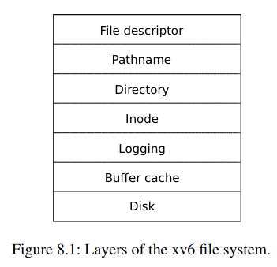
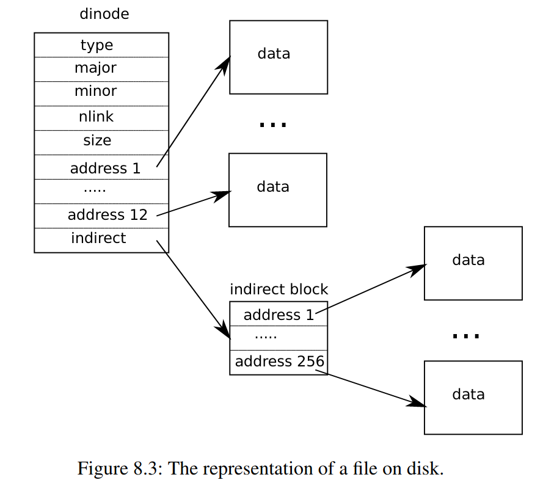

# 8.1 概览



1. Disk ： 读写磁盘
2. Buffer ： 缓存磁盘块，并保证同一时间只有一个内核进程访问磁盘块
3. Logging : 将更新磁盘的操作包装成一个 交易(transaction)，并保证crash时能自动恢复
4. Inode : 一个Inode代表一个文件
5. Directory : 将目录实现为一个特殊的inode，并且他的内容就是目录元素，每一个目录元素包含一个文件名和i-number
6. Pathname : 提供树形路径的文件名，并解析
7. File descriptor : 抽象Unix资源(pipes，devices，files)，简化用户操作

# 8.2 Buffer层

Buffer层的作用 : 1. 缓存最常访问的磁盘块  2. 保证只有磁盘块只有一个副本在内存，并且同一时间只有一个内核进程访问它

Buffer的定义(kernel/buf.h)
```
struct buf {
  int valid;   // has data been read from disk?
  int disk;    // does disk "own" buf?
  uint dev;
  uint blockno;
  struct sleeplock lock;
  uint refcnt;
  struct buf *prev; // LRU cache list
  struct buf *next;
  uchar data[BSIZE];
};
```
buf.lock ： 保护buffer，保证同一时间只能有一个内核进程访问它

关于buffer暴露出来的主要接口
1. bread : 获得某个磁盘块的内存buffer
```

// Return a locked buf with the contents of the indicated block.
struct buf*
bread(uint dev, uint blockno)
{
  struct buf *b;

  b = bget(dev, blockno);
  if(!b->valid) {
    virtio_disk_rw(b, 0);
    b->valid = 1;
  }
  return b;
}

```
2. bwrite : 将修改过的磁盘块buffer写回磁盘中
```
// Write b's contents to disk.  Must be locked.
void
bwrite(struct buf *b)
{
  if(!holdingsleep(&b->lock))
    panic("bwrite");
  virtio_disk_rw(b, 1);
}

```
3. brelse ： 当buffer使用完，释放buffer

# 8.3 Buffer缓存的代码

main (kernel/main.c:27)   -->  binit

```
struct {
  struct spinlock lock;
  struct buf buf[NBUF];

  // Linked list of all buffers, through prev/next.
  // Sorted by how recently the buffer was used.
  // head.next is most recent, head.prev is least.
  struct buf head;
} bcache;

bacache.lock : 保证只有磁盘块只有一个副本在内存

void
binit(void)
{
  struct buf *b;

  initlock(&bcache.lock, "bcache");

  // Create linked list of buffers
  bcache.head.prev = &bcache.head;
  bcache.head.next = &bcache.head;
  for(b = bcache.buf; b < bcache.buf+NBUF; b++){
    b->next = bcache.head.next;
    b->prev = &bcache.head;
    initsleeplock(&b->lock, "buffer");
    bcache.head.next->prev = b;
    bcache.head.next = b;
  }
}

```

bread --> bget  

```
bget(uint dev, uint blockno)
{
  struct buf *b;

  acquire(&bcache.lock);

  // Is the block already cached?
  for(b = bcache.head.next; b != &bcache.head; b = b->next){
    if(b->dev == dev && b->blockno == blockno){
      b->refcnt++;
      release(&bcache.lock);
      acquiresleep(&b->lock);
      return b;
    }
  }

  // Not cached.
  // Recycle the least recently used (LRU) unused buffer.
  for(b = bcache.head.prev; b != &bcache.head; b = b->prev){
    if(b->refcnt == 0) {
      b->dev = dev;
      b->blockno = blockno;
      b->valid = 0;
      b->refcnt = 1;
      release(&bcache.lock);
      acquiresleep(&b->lock);
      return b;
    }
  }
  panic("bget: no buffers");
}

```

# 8.6 日志层

日志系统调用的典型用法如下
```
begin_op(); //等待，直到没有正在commit的日志和磁盘有足够的空间存储日志时
...
bp = bread(...);
bp->data[...] = ...;
log_write(bp); // 将bp的block编号记录在日志中
...
end_op(); // 如果fs中没有正在执行的系统调用，commit
```
日志的定义
```
// Contents of the header block, used for both the on-disk header block
// and to keep track in memory of logged block# before commit.
struct logheader {
  int n;
  int block[LOGSIZE]; // 记录bolck编号
};

struct log {
  struct spinlock lock;
  int start;
  int size;
  int outstanding; // how many FS sys calls are executing.
  int committing;  // in commit(), please wait.
  int dev;
  struct logheader lh;
};
struct log log;

```

```
// called at the start of each FS system call.
void
begin_op(void)
{
  acquire(&log.lock);
  while(1){
    if(log.committing){ //如果正在commit，sleep
      sleep(&log, &log.lock);
    } else if(log.lh.n + (log.outstanding+1)*MAXOPBLOCKS > LOGSIZE){
      // 如果增加了该系统调用后，磁盘的日志空间不够，sleep
      // this op might exhaust log space; wait for commit.
      sleep(&log, &log.lock);
    } else {
      log.outstanding += 1;
      release(&log.lock);
      break;
    }
  }
}

```

```
// Caller has modified b->data and is done with the buffer.
// Record the block number and pin in the cache by increasing refcnt.
// commit()/write_log() will do the disk write.
//
// log_write() replaces bwrite(); a typical use is:
//   bp = bread(...)
//   modify bp->data[]
//   log_write(bp)
//   brelse(bp)
void
log_write(struct buf *b)
{
  int i;

  acquire(&log.lock);
  // log.size由超级块初始化，固定大小，为log block的数目
  if (log.lh.n >= LOGSIZE || log.lh.n >= log.size - 1)
    panic("too big a transaction");
  if (log.outstanding < 1)
    panic("log_write outside of trans");

  // 正常来说，应该在log.lh.block增加一个位置，用来记录当前buffer的block No
  // 但是，该block的Number已经出现了，所以 log absorption
  for (i = 0; i < log.lh.n; i++) {
    if (log.lh.block[i] == b->blockno)   // log absorption
      break;
  }
  // 将block的扇区编号记录在内存中，并在磁盘为它保留空间
  log.lh.block[i] = b->blockno;
  if (i == log.lh.n) {  // Add new block to log?
    // pin buffer，避免被驱逐
    // 即给他加refcnt，因为fs只会驱逐refcnt为0的buf
    // buffer必须一直在内存中直到commit
    bpin(b);
    log.lh.n++;
  }
  release(&log.lock);
}
```

```
// called at the end of each FS system call.
// commits if this was the last outstanding operation.
void
end_op(void)
{
  int do_commit = 0;

  acquire(&log.lock);
  log.outstanding -= 1;
  if(log.committing)
    panic("log.committing");
  if(log.outstanding == 0){
    do_commit = 1;
    log.committing = 1;
  } else {
    // begin_op() may be waiting for log space,
    // and decrementing log.outstanding has decreased
    // the amount of reserved space.
    wakeup(&log);
  }
  release(&log.lock);

  // 如果log.outstanding为0，commit
  if(do_commit){
    // call commit w/o holding locks, since not allowed
    // to sleep with locks.
    commit();
    acquire(&log.lock);
    log.committing = 0;
    wakeup(&log);
    release(&log.lock);
  }
}
```
commit有四个阶段 write_log -> write_head -> install_trans -> write_head

```
static void
commit()
{
  if (log.lh.n > 0) {
    write_log();     // Write modified blocks from cache to log
    write_head();    // Write header to disk -- the real commit
    install_trans(0); // Now install writes to home locations
    log.lh.n = 0;
    write_head();    // Erase the transaction from the log
  }
}
```
阶段1 ： 从transcation中，修改过的buffer从内存写到磁盘中的log区域中
```
// Copy modified blocks from cache to log.
static void
write_log(void)
{
  int tail;

  for (tail = 0; tail < log.lh.n; tail++) {
    struct buf *to = bread(log.dev, log.start+tail+1); // log block
    struct buf *from = bread(log.dev, log.lh.block[tail]); // cache block
    memmove(to->data, from->data, BSIZE);
    bwrite(to);  // write the log
    brelse(from);
    brelse(to);
  }
}
```
阶段2(commit point) ：把header写到磁盘中( a crash after the write will result in recovery replaying the transaction’s writes from the log. )
```
// Write in-memory log header to disk.
// This is the true point at which the
// current transaction commits.
static void
write_head(void)
{
  struct buf *buf = bread(log.dev, log.start);
  struct logheader *hb = (struct logheader *) (buf->data);
  int i;
  hb->n = log.lh.n;
  for (i = 0; i < log.lh.n; i++) {
    hb->block[i] = log.lh.block[i];
  }
  bwrite(buf);
  brelse(buf);
}
```
阶段3：读log中的块，然后写到文件系统对应位置中
```
// Copy committed blocks from log to their home location
static void
install_trans(int recovering)
{
  int tail;

  for (tail = 0; tail < log.lh.n; tail++) {
    struct buf *lbuf = bread(log.dev, log.start+tail+1); // read log block
    struct buf *dbuf = bread(log.dev, log.lh.block[tail]); // read dst
    memmove(dbuf->data, lbuf->data, BSIZE);  // copy block to dst
    bwrite(dbuf);  // write dst to disk
    if(recovering == 0)
      bunpin(dbuf);
    brelse(lbuf);
    brelse(dbuf);
  }
}
```
阶段4 : 将log header写为0
```
// Write in-memory log header to disk.
// This is the true point at which the
// current transaction commits.
static void
write_head(void)
{
  struct buf *buf = bread(log.dev, log.start);
  struct logheader *hb = (struct logheader *) (buf->data);
  int i;
  hb->n = log.lh.n;
  for (i = 0; i < log.lh.n; i++) {
    hb->block[i] = log.lh.block[i];
  }
  bwrite(buf);
  brelse(buf);
}
```

**日志的恢复**
第一个进程运行时，(kernel/proc:520)调用fsinit(kernel/fs.c) --> initlog(kernel/log.c) --> recover_from_log

```
// Init fs
void
fsinit(int dev) {
  readsb(dev, &sb);
  if(sb.magic != FSMAGIC)
    panic("invalid file system");
  initlog(dev, &sb);
}
```

```
void
initlog(int dev, struct superblock *sb)
{
  if (sizeof(struct logheader) >= BSIZE)
    panic("initlog: too big logheader");

  initlock(&log.lock, "log");
  log.start = sb->logstart;
  log.size = sb->nlog;
  log.dev = dev;
  recover_from_log();
}
```

```
static void
recover_from_log(void)
{
  read_head();
  install_trans(1); // if committed, copy from log to disk
  log.lh.n = 0;
  write_head(); // clear the log
}
```

# 8.7 Block allocator

balloc : 分配一个新的磁盘块
bfree : 释放磁盘块

# 8.8 Inode layer

## 磁盘
```
// On-disk inode structure
struct dinode {
  short type;           // File type
  short major;          // Major device number (T_DEVICE only)
  short minor;          // Minor device number (T_DEVICE only)
  short nlink;          // Number of links to inode in file system
  uint size;            // Size of file (bytes)
  uint addrs[NDIRECT+1];   // Data block addresses
};
```

## 内存
```
// in-memory copy of an inode
struct inode {
  uint dev;           // Device number
  uint inum;          // Inode number
  int ref;            // Reference count  有多少个指针指向inode，如果ref为0，则从内存中驱逐该inode
  struct sleeplock lock; // protects everything below here
  int valid;          // inode has been read from disk?

  short type;         // copy of disk inode
  short major;
  short minor;
  short nlink;
  uint size;
  uint addrs[NDIRECT+1];
};
```
内核会把内存中活跃的inode记录在itable中
```
// Thus a typical sequence is:
//   ialloc  获得内存中的inode
//   ......
//   ip = iget(dev, inum)
//   ilock(ip)
//   ... examine and modify ip->xxx ...
//   iunlock(ip)
//   iput(ip)
```
# 8.10



readi : 读inode
writei : 写inode
stati : 获取inode的元信息

# 8.11 目录层

```
// Directory is a file containing a sequence of dirent structures.
#define DIRSIZ 14

struct dirent {
  ushort inum;
  char name[DIRSIZ];
};
```

```
// Look for a directory entry in a directory.
// If found, set *poff to byte offset of entry.
struct inode*
dirlookup(struct inode *dp, char *name, uint *poff)
{
  uint off, inum;
  struct dirent de;

  if(dp->type != T_DIR)
    panic("dirlookup not DIR");

  for(off = 0; off < dp->size; off += sizeof(de)){
    if(readi(dp, 0, (uint64)&de, off, sizeof(de)) != sizeof(de))
      panic("dirlookup read");
    if(de.inum == 0)
      continue;
    if(namecmp(name, de.name) == 0){
      // entry matches path element
      if(poff)
        *poff = off;
      inum = de.inum;
      return iget(dp->dev, inum);
    }
  }

  return 0;
}
```
dirlookup : 根据对应名字，查找目录元素，返回对应inode

```
// Write a new directory entry (name, inum) into the directory dp.
int
dirlink(struct inode *dp, char *name, uint inum)
{
  int off;
  struct dirent de;
  struct inode *ip;

  // Check that name is not present.
  if((ip = dirlookup(dp, name, 0)) != 0){
    iput(ip);
    return -1;
  }

  // Look for an empty dirent.
  for(off = 0; off < dp->size; off += sizeof(de)){
    if(readi(dp, 0, (uint64)&de, off, sizeof(de)) != sizeof(de))
      panic("dirlink read");
    if(de.inum == 0)
      break;
  }

  strncpy(de.name, name, DIRSIZ);
  de.inum = inum;
  if(writei(dp, 0, (uint64)&de, off, sizeof(de)) != sizeof(de))
    panic("dirlink");

  return 0;
}
```
dirlink : 将新目录元素对应名字和inode写到目录dp中

```
static struct inode*
create(char *path, short type, short major, short minor)
{
  struct inode *ip, *dp;
  char name[DIRSIZ];

  if((dp = nameiparent(path, name)) == 0)
    return 0;

  ilock(dp);

  if((ip = dirlookup(dp, name, 0)) != 0){
    iunlockput(dp);
    ilock(ip);
    if(type == T_FILE && (ip->type == T_FILE || ip->type == T_DEVICE))
      return ip;
    iunlockput(ip);
    return 0;
  }

  if((ip = ialloc(dp->dev, type)) == 0)
    panic("create: ialloc");

  ilock(ip);
  ip->major = major;
  ip->minor = minor;
  ip->nlink = 1;
  iupdate(ip);

  if(type == T_DIR){  // Create . and .. entries.
    dp->nlink++;  // for ".."
    iupdate(dp);
    // No ip->nlink++ for ".": avoid cyclic ref count.
    if(dirlink(ip, ".", ip->inum) < 0 || dirlink(ip, "..", dp->inum) < 0)
      panic("create dots");
  }

  if(dirlink(dp, name, ip->inum) < 0)
    panic("create: dirlink");

  iunlockput(dp);

  return ip;
}
```
利用到了dirlookup和dirlink

# 8.12
namei 根据路径，返回对应的inode
```
struct inode*
namei(char *path)
{
  char name[DIRSIZ];
  return namex(path, 0, name);
}
```
nameiparrent 返回对应路径的parent inode，将对应路径的文件名复制到name中
```
struct inode*
nameiparent(char *path, char *name)
{
  return namex(path, 1, name);
}
```


```
skipelem
// Examples:
//   skipelem("a/bb/c", name) = "bb/c", setting name = "a"
//   skipelem("///a//bb", name) = "bb", setting name = "a"
//   skipelem("a", name) = "", setting name = "a"
//   skipelem("", name) = skipelem("////", name) = 0

// Look up and return the inode for a path name.
// If parent != 0, return the inode for the parent and copy the final
// path element into name, which must have room for DIRSIZ bytes.
// Must be called inside a transaction since it calls iput().
static struct inode*
namex(char *path, int nameiparent, char *name)
{
  struct inode *ip, *next;

  if(*path == '/')
    ip = iget(ROOTDEV, ROOTINO);
  else
    ip = idup(myproc()->cwd);

  while((path = skipelem(path, name)) != 0){
    ilock(ip);
    if(ip->type != T_DIR){
      iunlockput(ip);
      return 0;
    }
    if(nameiparent && *path == '\0'){
      // Stop one level early.
      iunlock(ip);
      return ip;
    }
    if((next = dirlookup(ip, name, 0)) == 0){
      iunlockput(ip);
      return 0;
    }
    iunlockput(ip);
    ip = next;
  }
  if(nameiparent){
    iput(ip);
    return 0;
  }
  return ip;
}
```
# 8.13 file descriptor layer

```
struct file {
  enum { FD_NONE, FD_PIPE, FD_INODE, FD_DEVICE } type;
  int ref; // reference count
  char readable;
  char writable;
  struct pipe *pipe; // FD_PIPE
  struct inode *ip;  // FD_INODE and FD_DEVICE
  uint off;          // FD_INODE
  short major;       // FD_DEVICE
};
```
在内核中，将所有打开的文件记录在全局文件表**ftable**中，文件表有如下几个函数
1. filealloc :  allocate a file(scans the file table for an unreferenced file (f->ref == 0) and returns a new reference)
2. filedup : create a duplicate reference(increments the reference count)
3. fileclose : release a reference(decrement ref cnt, when it  reaches zero, release it)
4. fileread filewrite filestat:  implement the stat, read, and write operations on file, filestat invoke stati.

```
uint64
sys_open(void)
{
  char path[MAXPATH];
  int fd, omode;
  struct file *f;
  struct inode *ip;
  int n;

  if((n = argstr(0, path, MAXPATH)) < 0 || argint(1, &omode) < 0)
    return -1;

  begin_op();

  if(omode & O_CREATE){
    ip = create(path, T_FILE, 0, 0);
    if(ip == 0){
      end_op();
      return -1;
    }
  } else {
    if((ip = namei(path)) == 0){
      end_op();
      return -1;
    }
    ilock(ip);
    if(ip->type == T_DIR && omode != O_RDONLY){
      iunlockput(ip);
      end_op();
      return -1;
    }
  }

  if(ip->type == T_DEVICE && (ip->major < 0 || ip->major >= NDEV)){
    iunlockput(ip);
    end_op();
    return -1;
  }
  if((f = filealloc()) == 0 || (fd = fdalloc(f)) < 0){
    if(f)
      fileclose(f);
    iunlockput(ip);
    end_op();
    return -1;
  }

  if(ip->type == T_DEVICE){
    f->type = FD_DEVICE;
    f->major = ip->major;
  } else {
    f->type = FD_INODE;
    f->off = 0;
  }
  f->ip = ip;
  f->readable = !(omode & O_WRONLY);
  f->writable = (omode & O_WRONLY) || (omode & O_RDWR);

  if((omode & O_TRUNC) && ip->type == T_FILE){
    itrunc(ip);
  }

  iunlock(ip);
  end_op();

  return fd;
}

```

```
// Allocate a file descriptor for the given file.
// Takes over file reference from caller on success.
static int
fdalloc(struct file *f)
{
  int fd;
  struct proc *p = myproc();

  for(fd = 0; fd < NOFILE; fd++){
    if(p->ofile[fd] == 0){
      p->ofile[fd] = f;
      return fd;
    }
  }
  return -1;
}
```