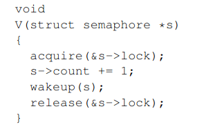
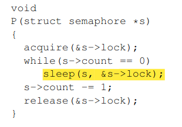

# page fault

## Copy-on-Write Fork
### Problem
fork复制父进程的用户空间的内存到子进程中，然后子进程exec，当父进程很大时，十分浪费。

### Solution
COW fork只给子进程创建一个页表，同时用户内存的PTE指向父进程的物理页，即不给子进程份分配新的物理页，只增加物理页的ref cnt，共享同一份物理页。COW fork将父进程和子进程的PTE(page table entry)权限标记为不可写。当父进程或子进程写COW页时，CPU会触发page fault信号。trap handler会侦测到page fault，然后给发生fault的进程分配一页物理页，然后复制原先物理页的内容到新的物理页中，并修改faulting进程的页表的pte指向新的物理页，以及标志pte为可写。当page fault handler返回时，用户进程将能够写该复制页。

### Implementation

0. fork时，不给子进程份分配新的物理页，只增加物理页的ref cnt，并增加子进程的映射，共享同一份物理页
1. 分配物理页时，设置每一块物理页的初始引用计数为1
2. 释放物理页时，只有引用计数为0才释放
3. 当发生异常时(如只读的页面试图写)，释放共享的物理页(-1)，申请一块新的物理页，并填写数据，修改权限
4. 当需要从内核copy数据到用户空间时，如果用户空间的地址指向的是COW页(假设不可写)，给COW页释放共享的物理页(-1)，申请一块新的物理页，并填写数据，修改权限

## mmap/munmap

### Problem
以往随机访问文件open，然后通过read/wirte系统调用以及lseek来移动到对应位置，两个系统调用。

open文件后，通过mmap将文件映射到内存中实现随机访问，减少1个系统调用。

对于随机访问，不再需要频繁lseek，减少系统调用次数，减少数据copy(不需要经过中间buffer)，访问的局部更好。

### Solution
给每个进程增加vm_area_struct数组，记录进程的vm_area，调用mmap时，只记录mmap要映射到哪个地址，记录fd，从fd的哪个位置开始，prot(PROT_READ/PROT_WRITE)、flag(MAP_SHARED/MAP_PRIVATE)，增加进程的vm_area的大小，不作实际分配(lazy allocation)，当进程访问该地址时，触发缺页中断，分配物理内存，读取文件对应inode内容到物理内存中并增加进程的页表映射。

## read/write

read/write ->  sys_read/sys_write -> readi/writei -> bread/bwrite

open

如果是创建 ： create返回一个inode，然后分配文件描述符，并把文件描述符的inode指向返回的inode，返回文件描述符

如果是打开 ： namei返回文件的inode，然后分配文件描述符，并把文件描述符的inode指向返回的inode，返回文件描述符

# lock

互斥锁 : 进程休眠
spinlock : 可能某个进程频繁的持有lock，进程不会休眠，一直旋转

ticker lock : spinlock + {next, owner}   按申请锁的顺序分配锁，公平
owner:当前正在吃的食客  next:表示放号的最新值

提高读的性能，允许读并行，即读的时候能够多个进程进入critical section :  rwlock/RCU(Read-Copy-Update)

rwlock :  让reader并行，只能一个writer进入critical section

两种实现方式: reader1 + writer1 + reader2
    1. reader2需要等待writer1完成后才能进入CS(对writer公平，但导致读者竞争)
    2. reader2不需要等待writer1完成，直接进入CS(对writer不公平，提高writer读延迟)

RCU : Read-Copy-Update
与rwlock相比，读者不需要锁，同时，写的时候也可以读
写 : 
    1. Copy原结构提到新的结构体
    2. Update在副本上修改新结构体
    3. 指向新结构体指针(writer publish，之后新结构体对writer可见)
    4. 待所有读完成，删除原结构体(grace period)

RCU如何确定是否有读者在引用结构体?

```
    #define rcu_read_lock()   preempt_disable() 禁止所有CPU上下文切换，即禁止切换进程
    #define rcu_read_unlock()   preempt_enable() 允许上下文切换
```

```
    synchronize_cpu() : 遍历每一个cpu，查看当前进程是否可以切换到指定cpu上，如果可以，说明所有的cpu已经经历过一次上下文切换，则读端已经结束
```


# 文件系统

## 基于inode的文件系统

ext2

## 基于table的文件系统

FAT32

NTFS(移动硬盘)


# 进程切换

context，即callee-saved寄存器，包括ra(i.e pc)、 sp(指向内核栈)、其他寄存器等。

线程切换与协程切换相比，代价主要在于需要进出内核！

# 进入内核的方式(Trap)

关中断，保存断点，设置scause，设置status，跳到中断处理函数...

注意到CPU没有自动切换内核页表，没有切换内核栈，除了pc以外没有保存任何寄存器，所以内核软件应该做这些任务。

寄存器可以用来系统系统调用的参数，如a0 a1表示调用的第一、第二个参数，a7表示系统调用号。

```
跳入 : uservec (kernel/trampoline.S:16) --> usertrap (kernel/trap.c:37)

返回 : usertrapret (kernel/trap.c:90)  --> userret (kernel/trampoline.S:88)
```

系统调用 : ecall，然后uservec --> usertrap --> syscall.

异常/中断 : 捕捉，然后handler

# 同步机制

## 信号量

P 消费者，等待，直到资源非0，然后将资源数量减1

V 生产者，资源加一

实现方式：





通过sleep/wakeup方式使用。

sleep : 标记进程为sleeping，然后执行sched

```
void
sleep(void *chan, struct spinlock *lk)
{
  struct proc *p = myproc();

  // Must acquire p->lock in order to
  // change p->state and then call sched.
  // Once we hold p->lock, we can be
  // guaranteed that we won't miss any wakeup
  // (wakeup locks p->lock),
  // so it's okay to release lk.

  acquire(&p->lock);  //DOC: sleeplock1
  release(lk);

  // Go to sleep.
  p->chan = chan;
  p->state = SLEEPING;

  sched();

  // Tidy up.
  p->chan = 0;

  // Reacquire original lock.
  release(&p->lock);
  acquire(lk);
}
```
wakeup : 寻找睡眠在给定channel的进程，然后标记为RUNNABLE
一把锁不够，所以两把锁，sleep()
```
void
wakeup(void *chan)
{
  struct proc *p;

  for(p = proc; p < &proc[NPROC]; p++) {
    if(p != myproc()){
      acquire(&p->lock);
      if(p->state == SLEEPING && p->chan == chan) {
        p->state = RUNNABLE;
      }
      release(&p->lock);
    }
  }
}
```

## 协程

每个协程维护上下文、栈、以及自身的状态(Free Running Runnable)

协程创建时需要将上下文的返回地址ra设置为函数的地址，以及设置上下文的sp指向栈底

每个协程需要主动让出CPU


## 进程通信VS线程通信

线程之间资源是共享的，主要将安全：信号量、锁、原子操作

进程之间资源是独立的，讲通信：管道、共享内存、信号、套接字